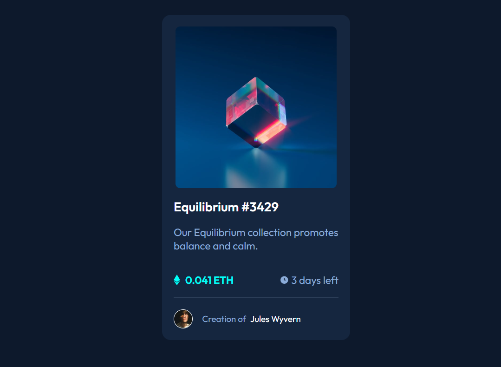

## Table of contents

- [Overview](#overview)
  - [The challenge](#the-challenge)
  - [Screenshot](#screenshot)
  - [Links](#links)
- [My process](#my-process)
  - [Built with](#built-with)
- [Author](#author)

## Overview

### The challenge

Users should be able to:

- View the optimal layout depending on their device's screen size
- See hover states for interactive elements

### Screenshot

### Links

- Solution URL: [GitHub](https://github.com/gabadadzeluca/nft-preview-card-component-React)
- Live Site URL: [Live URL]()

## My process

### Built with

- Flexbox
- Mobile-first workflow
- [React](https://reactjs.org/) - JS library
- CSS Modules

## Author

- LinkedIn - [Luca Gabadadze](https://www.linkedin.com/in/luca-gabadadze-6068b324a/)
